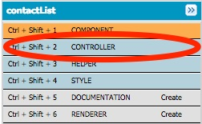
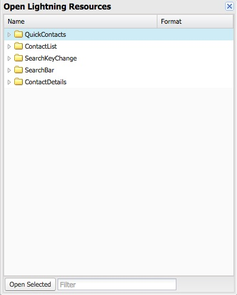

## Step 1: Create the Component

1. In the Developer Console, click **File** > **New** > **Lightning Component**. Specify **ContactList** as the bundle name and click **Submit**

2. Implement the component as follows:

    ```
    <aura:component controller="cc01.ContactController">

        <aura:handler name="init" value="{!this}" action="{!c.doInit}" />
        <aura:attribute name="contacts" type="Contact[]"/>

        <ul class="list-group">
            <aura:iteration items="{!v.contacts}" var="contact">
                <li class="list-group-item">
                    <a href="{! '#contact/' + contact.Id }">
                        <p>{!contact.Name}</p>
                        <p>{!contact.Phone}</p>
                    </a>
                </li>
            </aura:iteration>
        </ul>

    </aura:component>
    ```

    ### Code Highlights:
    - The **init** handler is defined to execute some code when the component is initialized. That code (**doInit**) is defined in the component **controller**. (you'll implement the controller in the next step)
    - The **contacts** attribute is defined to hold the list of Contact objects returned from the server
    - ```<aura:iteration>``` is used to iterate through the list of contacts and create an ```<li>``` tag for each contact


1. Click **File** > **Save** to save the file


## Step 2: Implement the Controller

1. Click **CONTROLLER**

    

1. Implement the Controller as follows:

    ```
    ({
        doInit : function(component, event, helper) {
            helper.getContacts(component);
        }
    })
    ```

    ### Code Highlights:
    - The controller has a single function called **doInit**. This is the function the component calls when it is initialized.
    - The doInit() function invokes the component helper **getContacts()** function to retrieve the list of contacts.

## Step 3: Implement the Helper

1. Click **HELPER**

    

1. Implement the Helper as follows:

    ```
    ({
        getContacts : function(component) {
            var action = component.get("c.findAll");
            action.setCallback(this, function(a) {
                component.set("v.contacts", a.getReturnValue());
            });
            $A.enqueueAction(action);
        }
    })
    ```

    ### Code Highlights:
    - You first get a reference to the findAll method in the component's server-side controller (ContactController) and store it in the **action** variable.
    - Since the call to the server findAll method is asynchronous, you register a callback function that is executed when the call returns: you simply assign the list of contacts returned by the server to the component's **contacts**.
    - $A.enqueueAction(action) actually sends the request to execute the findAll() method to the server. More precisely, it adds the call to the queue of asynchronous server calls. That queue is an optimization feature of Lightning.


## Step 4: Add Contact List to the Application

1. In the developer console, go back to the **QuickContacts** application.

    If you don't see the tab in the developer console, Select File > Open Lightning Resources in the Developer Console menu, select QuickContacts in the dialog, and click the **Open Selected** button.

    


1. Add the ContactList component in the first column of the application layout.

    ```
    <div class="container">
        <div class="row">
            <div class="col-sm-12">
                <cc01:ContactList/>
            </div>
        </div>
    </div>
    ```

1. Click **Preview** or **Update Preview**

    

1. Preview the application in your browser

    


## Step 5: Add Style

Notice that there is probably too much space above and below the phone number in the above screenshot. In this step, you'll add a style to the component to remove that extra space.


1. Click **STYLE**

    

1. Implement the following style:

    ```
    .THIS p {
        margin: 0;
    }
    ```

1. Click **File** > **Save** to save the file

1. In the developer console, go back to the **QuickContacts** application, click **Preview** or **Update Preview** to preview the application in your browser

    


<div class="row" style="margin-top:40px;">
<div class="col-sm-12">
<a href="create-lightning-application.html" class="btn btn-default"><i class="glyphicon glyphicon-chevron-left"></i> Previous</a>
<a href="create-searchbar-component.html" class="btn btn-default pull-right">Next <i class="glyphicon glyphicon-chevron-right"></i></a>
</div>
</div>
